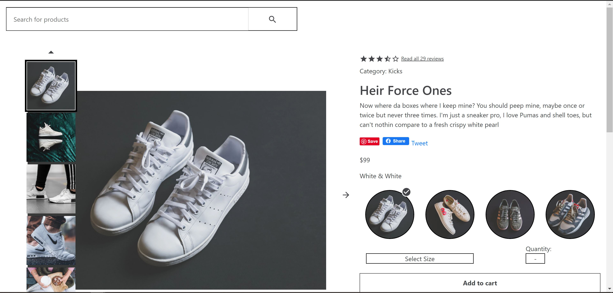
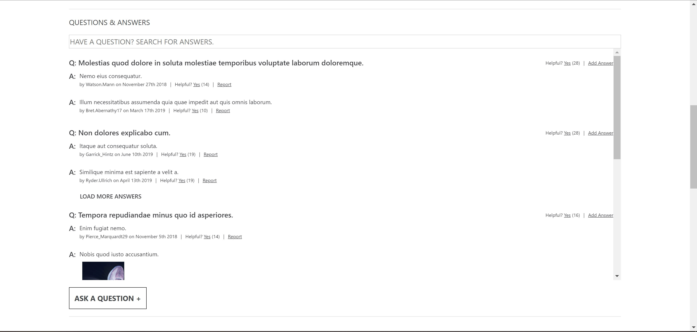
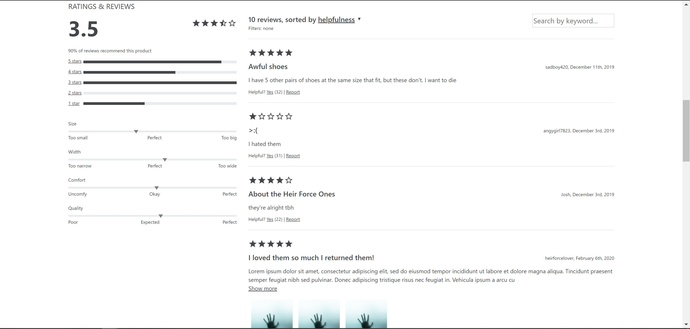

# Greenfield Product Portal
This React app is a mockup of this example retail portal: https://xd.adobe.com/view/e600dc0f-454c-44e3-5075-7872d04189ff-9031/?fullscreen

It features an overview section that displays product info and images. This is alongside an image carousel, size options, quantity, and cart system.

Then, a Question and Answers section that allows you to create questions, report questions, and create answers. You may also report any misleading/inappropriate answers. 

Finally, the Greenfield Product Portal features a Ratings and Reviews section. This displays all of the information provided by the reviews for that specific product, like stars, amount recommended, as well as characteristic ratings. And in the Reviews area, displays a list of reviews, which can be sorted with a dropdown option. You may also rate Ratings, Reviews, Questions, and Answers as helpful.

This project uses the separate APIs that each team member created, which can be found here:
https://github.com/blackwayv/Products_API

https://github.com/Team-JAN/ReviewsAPI

https://github.com/nicolemunoz99/Q-and-A-microservice

## Getting Started
It is simple to get the app running, just follow these instructions!

### Installation
To preview the app, you will need npm. In your terminal, clone the repository:

`git clone https://github.com/blackwayv/fec`

Then, install the dependencies and prepare the program

`npm install

npm run build`

Finally, run the app!

`npm start`

## Built With
* JavaScript
* jQuery
* React
* Bootstrap
* HTML5/CSS

## Acknowledgements
* https://github.com/nicolemunoz99 created the Product Overview section

* https://github.com/alexanderkho created the Questions and Answers section

* https://github.com/blackwayv created the Ratings and Reviews section
